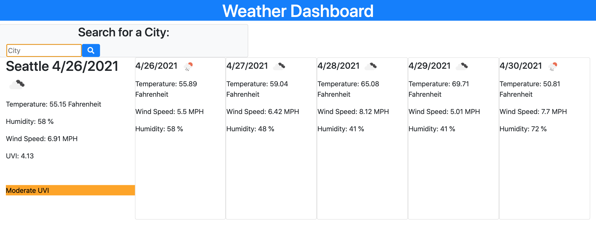

Server-Side APIs Challenge: Weather Dashboard

User Story: AS A traveler
I WANT to see the weather outlook for multiple cities
SO THAT I can plan a trip accordingly

Acceptance Criteria: GIVEN a weather dashboard with form inputs
WHEN I search for a city
THEN I am presented with current and future conditions for that city and that city is added to the search history
WHEN I view current weather conditions for that city
THEN I am presented with the city name, the date, an icon representation of weather conditions, the temperature, the humidity, the wind speed, and the UV index
WHEN I view the UV index
THEN I am presented with a color that indicates whether the conditions are favorable, moderate, or severe
WHEN I view future weather conditions for that city
THEN I am presented with a 5-day forecast that displays the date, an icon representation of weather conditions, the temperature, the wind speed, and the humidity
WHEN I click on a city in the search history
THEN I am again presented with current and future conditions for that city

Description:
Built a weather dashboard that features dynamically updated HTML and CSS. When a user enters a city name and clicks search, then they are presented with that city's weather for the day and the rest of the week. The user will be able to see the temperature, wind speed, humidity, and UVI of the city they entered. In addition, various icons are displayed to portray the weather of a given day. Also, the color of the UVI section will change depending on the UVI value of the current day.

Screenshots:

URL of Deployed Application: https://aidanwanberg.github.io/weather-dashboard/

URL of GitHub Repository: https://github.com/aidanwanberg/weather-dashboard